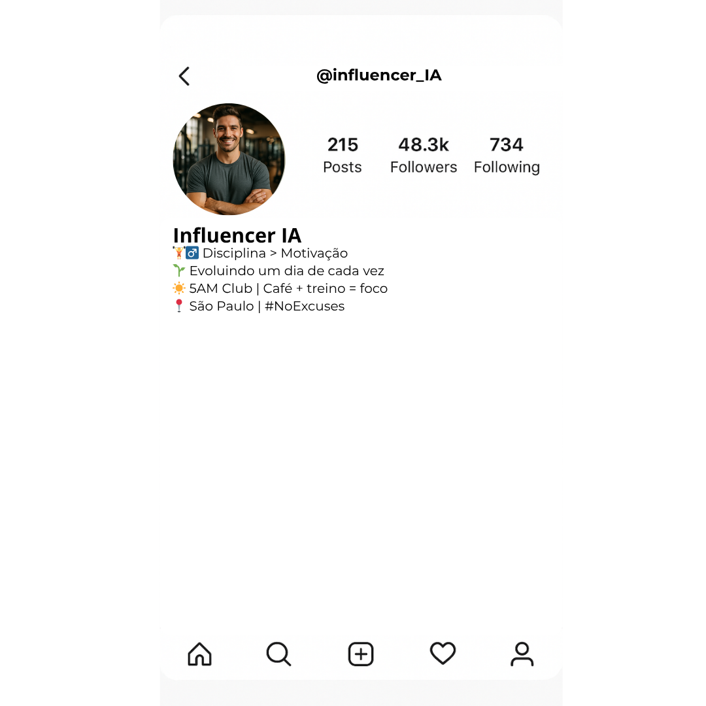
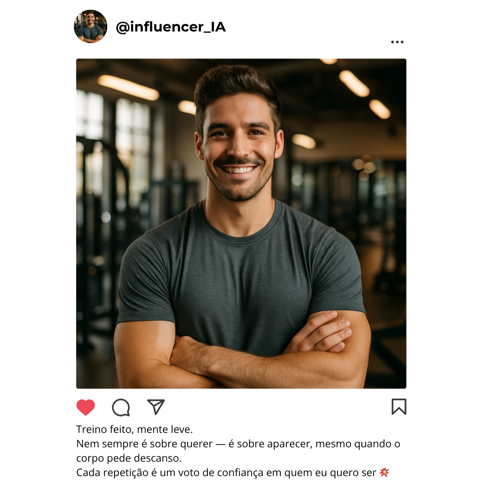
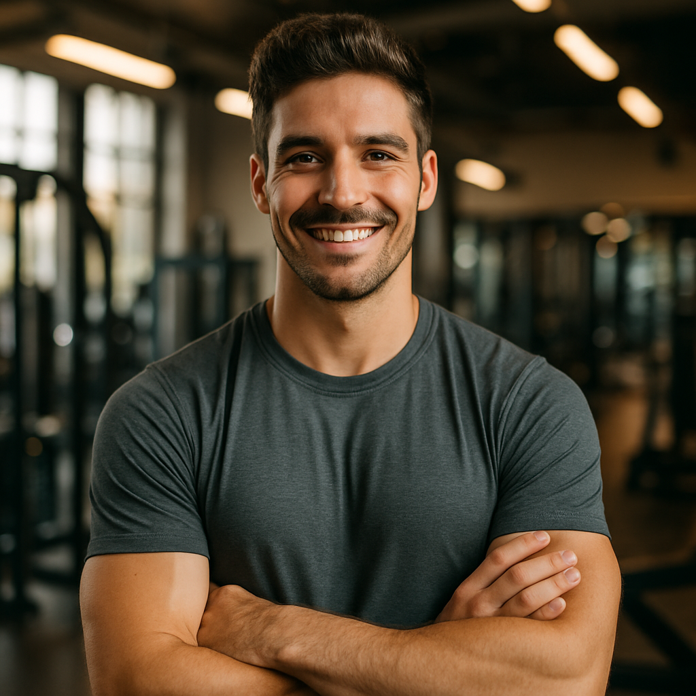

# Fake Influencer Detector 🤖📱🏋️‍♀️
> Este projeto foi desenvolvido como parte do Bootcamp da DIO sobre IAs Generativas em parceria com a AWS.

## 📒 Descrição
A proposta desse projeto é explorar o fenômeno dos "influencers falsos" que serão gerados por Inteligência Artificial.  
Inspirado na tendência **“Natty or Not?”** (Natural ou não), a ideia é mostrar como as IAs generativas conseguem criar perfis extremamente realistas de influenciadores, por exemplo, do mundo de fitness.

Inclusive, essa é uma situação que acontece muito nos dias atuais e gera a reflexão de até que ponto conseguimos distinguir o que é natural e o que é sintético.

## 🤖 Tecnologias Utilizadas
- **ChatGPT (GPT-5)** → geração de texto (legenda e perfil)

- **Sora** → criação da imagem do “influencer”

- **Canva** → montagem visual final (post estilo Instagram)

- **GitHub** → hospedagem e documentação do projeto

## 🧐 Processo de Criação
1. **Geração da imagem:** usei o Sora para criar uma imagem hiper-realista de um “influencer fitness”, com instruções detalhadas sobre aparência, iluminação e estilo de foto de academia.
2. **Criação da biografia:** pedi ao ChatGPT para gerar uma bio curta e convincente para o perfil, com frases típicas de influenciadores (“grind never stops”, emojis e hashtags motivacionais).
3. **Edição final:** montei a imagem e o texto em um post visual no Canva, simulando uma publicação real de rede social.  
4. **Reflexão:** finalizei com uma comparação entre o conteúdo gerado e o comportamento real de perfis humanos, destacando a sutileza das diferenças.

## 🚀 Resultados
Por se tratar de um projeto simples e de curta duração (proposta do Bootcamp), o resultado foi um perfil visualmente convincente, com texto e estética típicos de um influencer fitness.

As montagens feitas no Canva não ficaram idênticas a um perfil real do Instagram por limitações de edição de imagem, mas cumprem bem o papel de simular uma persona digital criada por IA em poucos minutos.

Mesmo analisando de perto a foto, é difícil notar que se trata de algo artificial, ainda mais se levarmos em conta que é comum o uso de editores de imagem como o Photoshop.  

O projeto ilustra o poder (e o risco) das IAs generativas na criação de identidades digitais.

## 💭 Reflexão
O desafio aborda mais a questão **ética** que envolve as inteligências artificiais do que aspectos **técnicos**.

Inclusive, para realizar esse projeto, utilizei a IA para me fornecer ideias que eu pudesse desenvolver. Apesar de ter feito o refinamento da ideia e várias etapas (edições, análises, filtragem de ideias), o uso da IA me ajudou fornecendo orientação inicial e reduzindo o tempo necessário para a realização do projeto.

Este projeto é um lembrete de que a autenticidade continua sendo um dos diferenciais mais humano que existem.